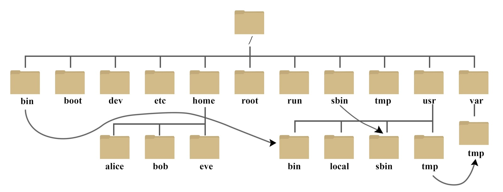

## linux终端快捷键
- **`Ctrl + Alt + t` 新建终端**
- `Shift + Ctrl + t` 在已有终端上打开新的tab
- `Ctrl + d` 关闭当前tab，若只有一个tab则关闭终端
- `Shift + Ctrl + q` 关闭当前终端，无论终端有几个tab
- `F11` 切换全屏/退出全屏
- `Ctrl + Shift + =` 放大终端字体
- `Ctrl + -` 缩小终端字体
- **`Ctrl + Shift + C` 复制**
- **`Ctrl + Shift + V` 粘贴**
- `鼠标滚轮` 如果用鼠标选中一段连续的文本，直接点击鼠标滚轮即可完成复制、粘贴的功能，粘贴位置在当前活动光标处
- `Alt + b`或`Alt + 键盘左键` 向前移动一个词的距离
- `Alt + f`或`Alt + 键盘右键` 向后移动一个词的距离
- `Esc + b`或`Esc + 键盘左键` 移动到当前单词的开头
- `Esc + f`或`Esc + 键盘右键`移动到当前单词的结尾 
- **`Ctrl + a` 移动光标到命令行首**
- **`Ctrl + e` 移动光标到命令行尾**
- **`Tab` 自动补全**
- **`Ctrl + w` 删除光标之前的一个词**
- **`Ctrl + u` 从当前光标所在位置向左全部删除**
- **`Alt + d` 删除光标之后的一个词**
- **`Ctrl + k` 从当前光标所在位置向右全部删除**
- **`向上向下箭头` 查看历史命令，只要按上下箭头即可，命令一个一个显示**
- `Ctrl + r` 查看历史命令，需要输入命令的起始字母，剩下的部分自动补全
- `Ctrl + g` 从历史搜索模式 `Ctrl + r` 退出
- **`Ctrl + c` 取消当前行输入的命令**
- `Ctrl + s` 暂停当前终端
- `Ctrl + q` 恢复当前终端
- **`Ctrl + l` 清空屏幕**
> **参考文章** 
> [Linux的shell终端常用快捷键大全](https://zhuanlan.zhihu.com/p/29538650)
## linux常用指令
- `ls`
  - 列出目录内容 (非以.开始的文件和目录) (以.开始的文件和目录会被隐藏) 
- `ls -a` 
  - 列出目录内容（所有的文件和目录）
- `ls -la`
  - 列出当前目录下的所有文件和目录的详细信息
- `ls -d *`
  - 列出当前目录下的目录名称，而不是目录下的内容。
- `pwd` 显示当前目录的绝对路径
- `mkdir` 
  - 语法`mkdir [-p] dirname`
  - 添加`-p`选项可以直接创建完整目录
- `whoami` 显示当前用户名
- `file filename` 显示指定文件的属性。
- `type -p commandname`
  - 显示命令 `commandname` 所在的地方
  - `which commandname` 也可以用来做这个
- `type commandname`
  - 显示命令 `commandname` 的信息。
- `whatis commandname`
  - 显示命令 `commandname` 的一句话帮助
- `man -a commandname`
  - 显示命令 `commandname` 的解释信息
***
### linux目录结构

- `/` 根目录
- `~` 用户主目录( `/home/username` 目录)
- `.` 当前目录
- `..` 上一级目录
>**参考文章** 
>[linux目录系统结构](https://www.runoob.com/linux/linux-system-contents.html)
***
- `cd <路径名>`
  - 切换到指定路径
  - p.s. 不要输入 `<` 和 `>` 
- `cd -`
  - 切换到上一次所去的目录
- `touch <文件名路径>`
  - 创建文件
- `cp <文件1路径> <文件2路径>`
  - 拷贝一个已有的`文件1`到`文件2`。
- `rm <文件名路径>`
  - 删除文件
- `rm -r <文件目录>`
  - 删除目录
  - p.s. `-r`选项在许多linux命令中都会使用到，意思是使命令递归地对目录中所有文件执行，在想要对目录执行操作时，必须要加这个选项
- `mv` 移动文件命令
  - `mv <文件1> <文件2>`
    - 把已有的文件1重命名为文件2
  - `mv foo bar/baz`
    - 把已有的文件foo移动到新位置并重命名为bar/baz，目录bar必须存在
- `chmod` 控制用户对文件的权限
  - Linux/Unix 的文件调用权限分为三级 : 文件所有者（Owner）、用户组（Group）、其它用户（Other Users），每一级又有读、写、执行三个权限
  
  - 只有文件所有者和超级用户可以修改文件或目录的权限
  - 指定权限可以使用绝对模式（八进制数字模式）或者符号模式
  - 符号模式语法
    - `chmod <用户类型><操作符><权限>`
      - `<用户类型>`        
        - `u` 文件所有者
        - `g` 文件所有者所在组
        - `o` 所有其他用户
        - `a` 所有用户, 相当于ugo
      - `<操作符>`
        - `+` 为指定的用户类型增加权限
        - `-` 去除指定用户类型的权限
        - `=` 直接设置指定用户类型的权限
      - `<权限>`
        - `r` 读 设置为可读权限
        - `w` 写 设置为可写权限
        - `x` 执行 设置为可执行权限
    - e.g. `chmod u+x` 意思是给文件所有者增加执行权限
  - 绝对模式语法  
    - 三位二进制数代表相对应权限的有无，1即有0即无
    - 然后将二进制数转换为八进制数，以一位八进制数代表相应用户类型的权限
    - e.g. `chmod 777`即将文件所有者、文件所有者所在的用户组、其他用户的权限都设置为可读可写可执行
- `top`
  - 全屏显示进程信息。输入`q`退出
- `kill <进程号>`
  - 杀死指定进程
- `sudo`
  - `sudo` 的全称为：super user do 顾名思义：干超级用户才能干的事！所以sudo最常用的功能是在要执行的命令前加上，从而以超级管理员权限(root)执行命令
- `apt`
  - `apt`（Advanced Packaging Tool）是一个在 Debian 和 Ubuntu 中的 Shell 软件包管理器
  - `apt` 命令提供了查找、安装、升级、删除某一个、一组甚至全部软件包的命令，而且命令简洁而又好记
  - `apt` 命令执行需要超级管理员权限(root)
  - `apt` 常用命令
    - `sudo apt install <package_name>` 安装指定的软件命令
    - `sudo apt update` 查找更新，列出所有可更新的软件清单
    - `sudo apt upgrade` 升级所有可升级软件包
    - `sudo apt full-upgrade` 升级软件包，升级前会先删除需要更新软件包
    - `sudo apt upgrade <package_name>` 更新指定的软件命令
    - `sudo apt show <package_name>` 显示软件包具体信息,例如：版本号，安装大小，依赖关系等
    - `sudo apt remove <package_name>` 删除软件包命令
    - `sudo apt purge <package_name>` 移除软件包及配置文件
    - `sudo apt autoremove` 清理不再使用的依赖和库文件
    - `apt list --installed` 列出所有已安装的包

> **参考文章** 
> [关于 Ubnutu Linux 终端的必知必会的 19 件超简单的事情 | Linux 中国](https://zhuanlan.zhihu.com/p/442995159) 
> [Ubuntu Manual | Ubuntu 参考手册](https://wiki.ubuntu.com.cn/UbuntuManual) 
> [Linux chmod命令](https://www.runoob.com/linux/linux-comm-chmod.html) 
> [Linux apt命令](https://www.runoob.com/linux/linux-comm-apt.html)
